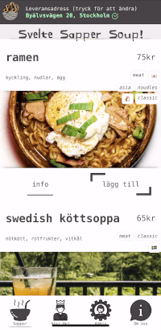
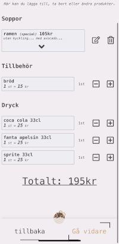

# Svelte Sapper Soup! 🥣

##### _An implementation of a fast food online service after a complete UX study._

#

#

This is the result of 1 month of UX-studies from a specific case
followed by 1 month of implementation.

##### _Visit the hosted version of [Svelte Sapper Soup!](https://frontend-soup.herokuapp.com)_

#

#

##### _Read this project's [UX-story](ux/README.md)_

_(Raw UX-docs (swe) in the ux-folder)_

#

#

#### SNAPSHOTS

| **menu**                                 | **pick a soup**                         | **cart**                                |
| ---------------------------------------- | --------------------------------------- | --------------------------------------- |
|  |  |  |

| **checkout**                                 | **confirmation**                                | **tracking delivery**                       |
| -------------------------------------------- | ----------------------------------------------- | ------------------------------------------- |
|  |  |  |

#

#

#### STACK

- [sapper & rollup](https://github.com/sveltejs/sapper) prepare the meal
- [svelte](https://svelte.dev/) greets the client
- [mongo](https://www.mongodb.com/) keeps track of the JWT-signed guestlist and serves the main course (see [backend-soup](https://github.com/butalsoverycool/backend-soup))

#

#

#### FUNCTIONALITY

- JWT-auth for user management
- Version 1 is without local/session-storage, only svelte state + DB-fetching
- Validating real addresses and tracking delivery on map

#

#

#### TODO

- Manage addresses
- More admin features
- Stuff

#

#

#### GET IT RUNNING

- Clone this and enter the project folder

```bash
# install with yarn or npm
yarn install
# run
yarn dev
```

- Check out localhost:3000
